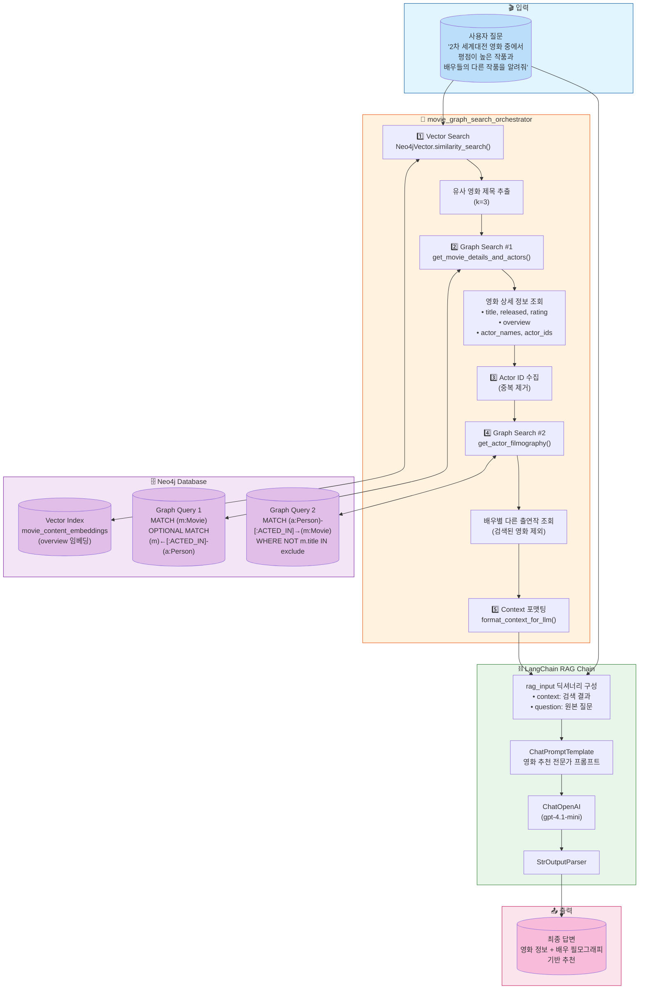

# 로직 처리 흐름도

```mermaid
flowchart TB
    subgraph Input["🎬 입력"]
        A[("사용자 질문<br/>'2차 세계대전 영화 중에서<br/>평점이 높은 작품과<br/>배우들의 다른 작품을 알려줘'")]
    end

    subgraph Orchestrator["🔄 movie_graph_search_orchestrator"]
        B["1️⃣ Vector Search<br/>Neo4jVector.similarity_search()"]
        C["유사 영화 제목 추출<br/>(k=3)"]
        D["2️⃣ Graph Search #1<br/>get_movie_details_and_actors()"]
        E["영화 상세 정보 조회<br/>• title, released, rating<br/>• overview<br/>• actor_names, actor_ids"]
        F["3️⃣ Actor ID 수집<br/>(중복 제거)"]
        G["4️⃣ Graph Search #2<br/>get_actor_filmography()"]
        H["배우별 다른 출연작 조회<br/>(검색된 영화 제외)"]
        I["5️⃣ Context 포맷팅<br/>format_context_for_llm()"]
    end

    subgraph Neo4j["🗄️ Neo4j Database"]
        V[("Vector Index<br/>movie_content_embeddings<br/>(overview 임베딩)")]
        G1[("Graph Query 1<br/>MATCH (m:Movie)<br/>OPTIONAL MATCH<br/>(m)←[:ACTED_IN]-(a:Person)")]
        G2[("Graph Query 2<br/>MATCH (a:Person)-[:ACTED_IN]→(m:Movie)<br/>WHERE NOT m.title IN exclude")]
    end

    subgraph RAGChain["⛓️ LangChain RAG Chain"]
        J["rag_input 딕셔너리 구성<br/>• context: 검색 결과<br/>• question: 원본 질문"]
        K["ChatPromptTemplate<br/>영화 추천 전문가 프롬프트"]
        L["ChatOpenAI<br/>(gpt-4.1-mini)"]
        M["StrOutputParser"]
    end

    subgraph Output["📤 출력"]
        N[("최종 답변<br/>영화 정보 + 배우 필모그래피<br/>기반 추천")]
    end

    %% 연결
    A --> B
    B <--> V
    B --> C
    C --> D
    D <--> G1
    D --> E
    E --> F
    F --> G
    G <--> G2
    G --> H
    H --> I
    
    I --> J
    A --> J
    J --> K
    K --> L
    L --> M
    M --> N

    %% 스타일링
    style Input fill:#e1f5fe,stroke:#01579b
    style Orchestrator fill:#fff3e0,stroke:#e65100
    style Neo4j fill:#f3e5f5,stroke:#7b1fa2
    style RAGChain fill:#e8f5e9,stroke:#2e7d32
    style Output fill:#fce4ec,stroke:#c2185b
    
    style A fill:#bbdefb
    style N fill:#f8bbd9
    style V fill:#e1bee7
    style G1 fill:#e1bee7
    style G2 fill:#e1bee7
```